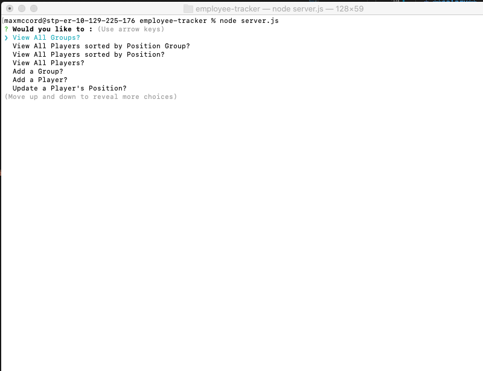
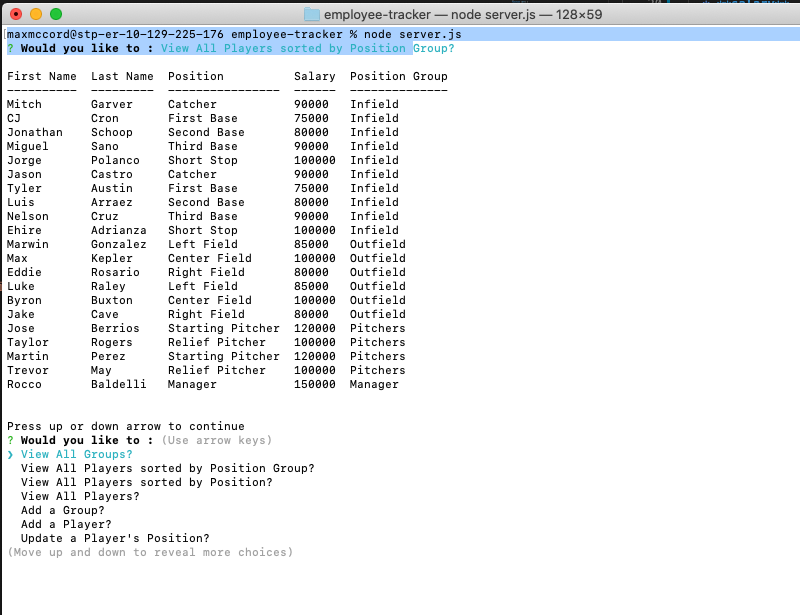
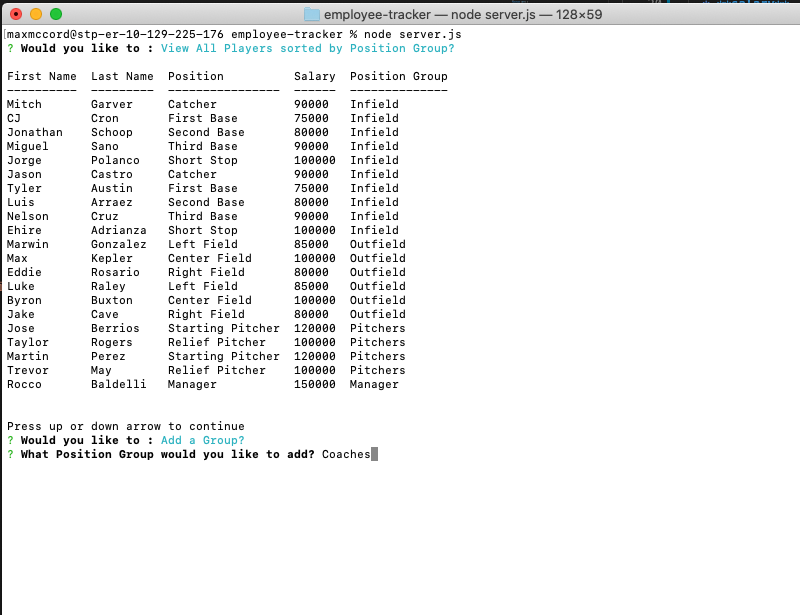
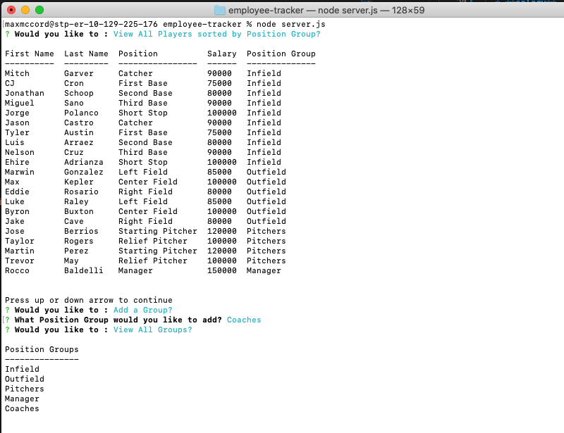
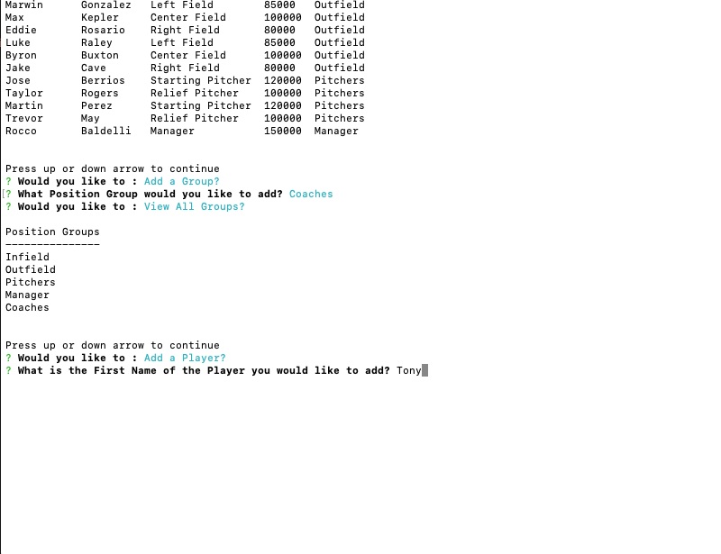
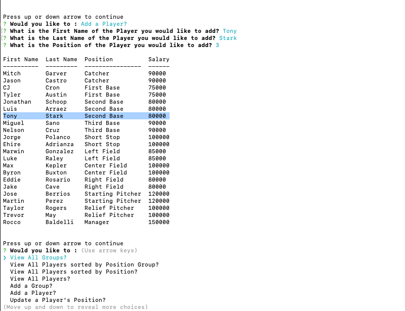

# Unit 12 MySQL Homework: Employee Tracker

## Git Hub Repo
https://github.com/maxdmc1/employee-tracker

## Instructions

Design the following database schema containing three tables:

* **department**:

  * **id** - INT PRIMARY KEY
  * **name** - VARCHAR(30) to hold department name

* **role**:

  * **id** - INT PRIMARY KEY
  * **title** -  VARCHAR(30) to hold role title
  * **salary** -  DECIMAL to hold role salary
  * **department_id** -  INT to hold reference to department role belongs to

* **employee**:

  * **id** - INT PRIMARY KEY
  * **first_name** - VARCHAR(30) to hold employee first name
  * **last_name** - VARCHAR(30) to hold employee last name
  * **role_id** - INT to hold reference to role employee has
  * **manager_id** - INT to hold reference to another employee that manager of the current employee. This field may be null if the employee has no manager
  
## Screen Shots

## Installation
All files should be kept in the same folder structure and not moved.  node.js, console.table, and inquirer are also required

